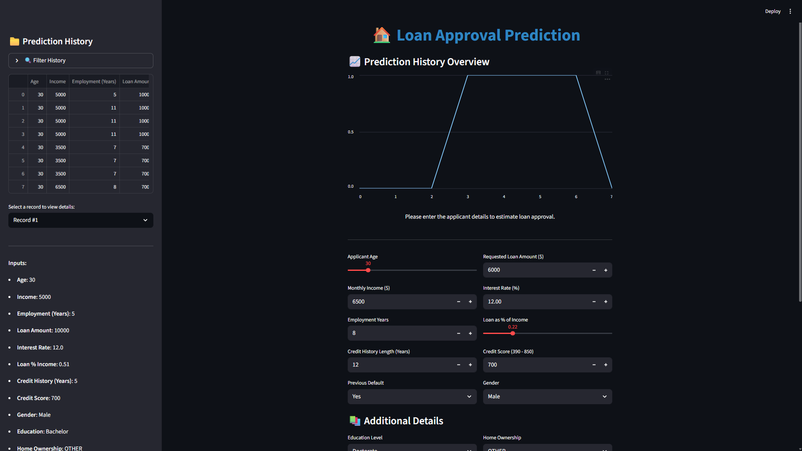
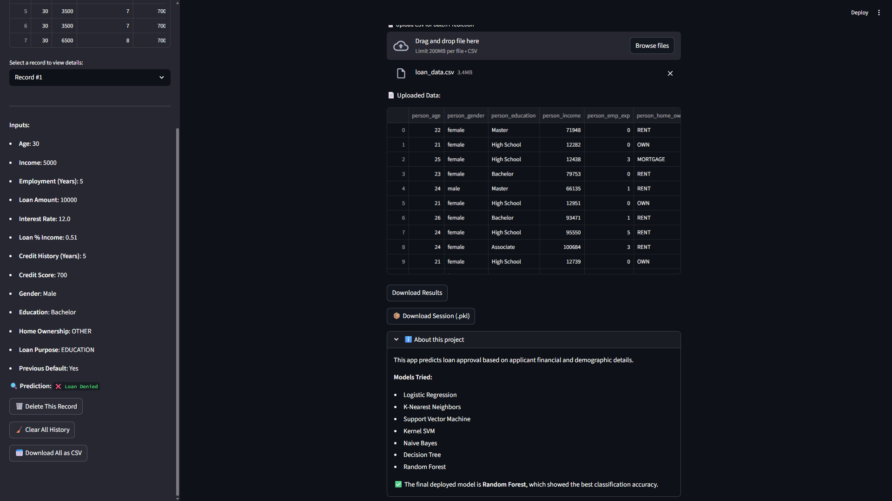
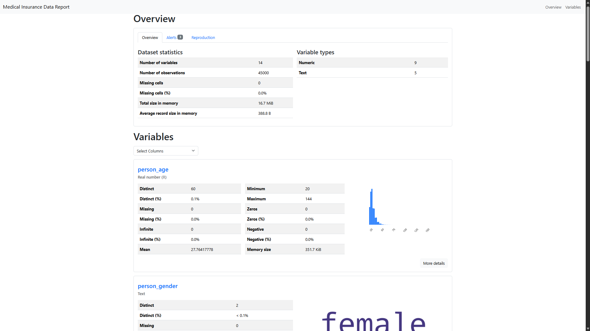
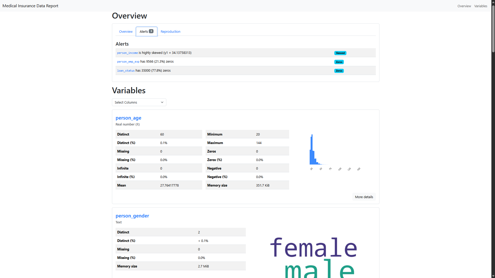
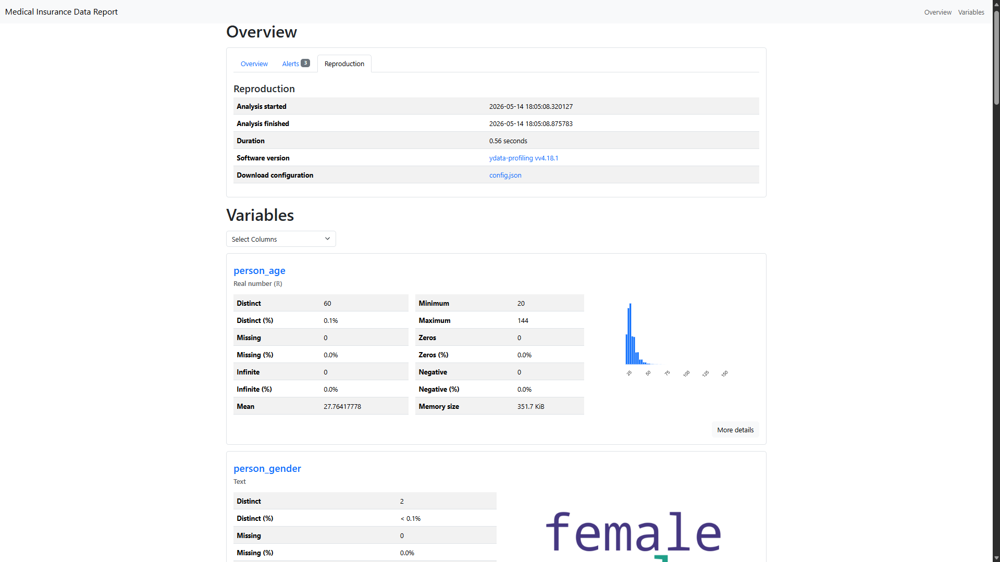

# 🏦 Loan Approval Prediction: ML Classification Pipeline

## Project Overview
This repository features a production-ready Machine Learning solution designed to predict loan eligibility. The system automates the decision-making process by comparing multiple classification algorithms to identify the most accurate model for financial risk assessment.

## Technical Highlights
* **Automated Selection Engine:** The pipeline evaluates various models (Logistic Regression, Random Forest, Decision Tree, etc.) and highlights the top performer based on Accuracy and F1-Score.
* **Production-Ready Deployment:** Includes an interactive web interface built with **Streamlit** for real-time inference.
* **In-depth EDA:** Comprehensive Exploratory Data Analysis to understand feature correlations and applicant demographics.

## Model Performance & Results
After rigorous training and evaluation on the dataset, the models achieved the following accuracy:

| Model | Accuracy |
| :--- | :---: |
| **Random Forest** | **~98%** |
| **Decision Tree** | **~98%** |
| **Logistic Regression** | **~92%** |

> **Finding:** The **Random Forest** model was selected as the primary engine for the deployment app due to its high precision and robust performance against overfitting.

## Environment & Requirements
* **Python Version:** 3.10.
* **Core Libraries:** `scikit-learn`, `pandas`, `numpy`, `matplotlib`, `seaborn`, `streamlit`.
1. **Clone the repository:**
   ```bash
   git clone https://github.com/Mohamed1dHesham/ML-Classification-Pipeline.git
    cd ML-Classification-Pipeline
   
2. **Install Dependencies:**

   ```bash
      pip install pandas numpy scikit-learn matplotlib seaborn streamlit
   ```
      
🏃 How to Run
1. Exploration & Training
To review the data analysis and model comparison, open the Jupyter Notebook:

   ```Bash
   jupyter notebook loan_classification_models.ipynb
   ```
2. Live Web Application
To launch the prediction dashboard for end-users, run:

   ```bash
   streamlit run app.py
   ```

### 1. AI Prediction Dashboard (Streamlit)
The application provides a sleek, user-friendly interface where users can manually input applicant data. 
* **Real-time Prediction:** As soon as the "Predict" button is clicked, the backend processes the data through the optimized Random Forest model to provide an instant decision.
* **Input Validation:** The UI ensures that all financial and demographic inputs are within valid ranges before processing.





### 2. Interactive Data Insights & History (HTML-based Components)
Beyond single predictions, the system features an interactive data management section:
* **Dynamic Results Table:** An embedded interactive table that displays prediction history, allowing users to track and review previous assessments.
* **Batch Processing Preview:** A specialized view for uploaded CSV files, where the system renders a data preview, giving the user a clear look at the records before and after prediction.
* **Data Visualization:** Integrated charts and graphs that visualize feature correlations (like Income vs. Loan Amount), making complex data easy to interpret at a glance.








⚖️ License
Licensed under the MIT License - see the [LICENSE](https://github.com/Mohamed1dHesham/ML-Classification-Pipeline/blob/main/LICENSE) file for details.

## 🎓 About
Developed by **Mohamed Hesham**, a Computer Science Student at **Modern Academy**. 
This project was completed as part of the **Summer Field Training (Internship)** requirements, focusing on the practical application of Machine Learning and Data Science in real-world scenarios.

* **Institution:** Modern Academy for Computer Science & Management Technology in Maadi.
* **Purpose:** Field Training Project (Summer 2025).
* **Focus:** End-to-End AI deployment and automated classification systems.
